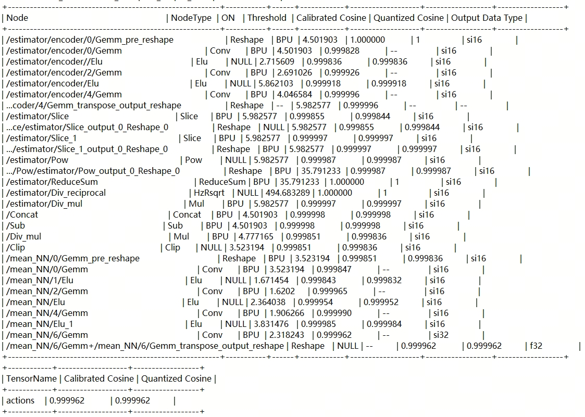
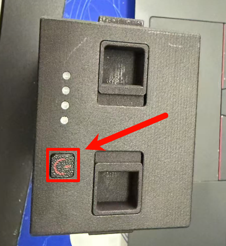
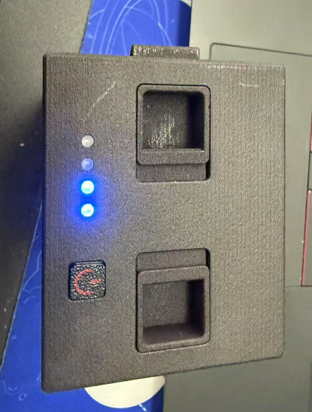
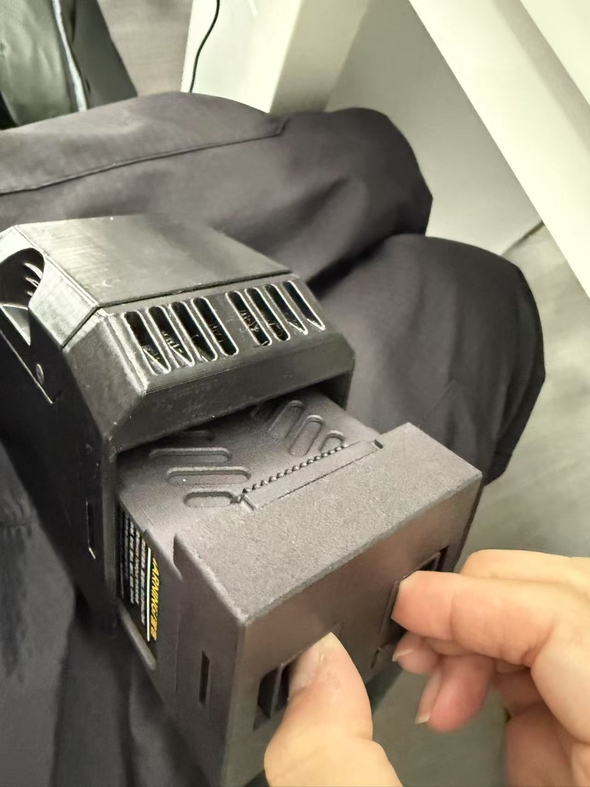
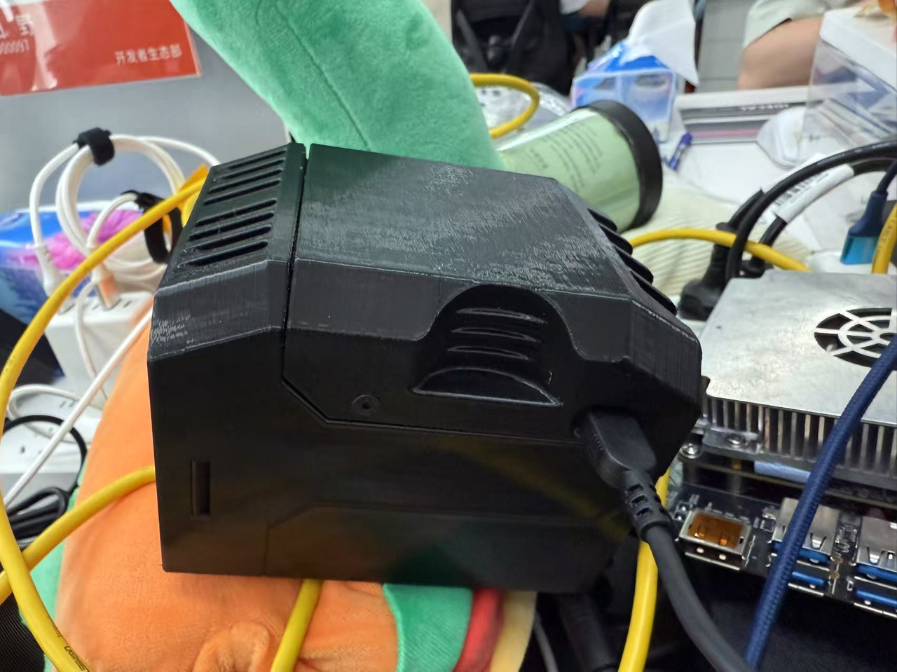
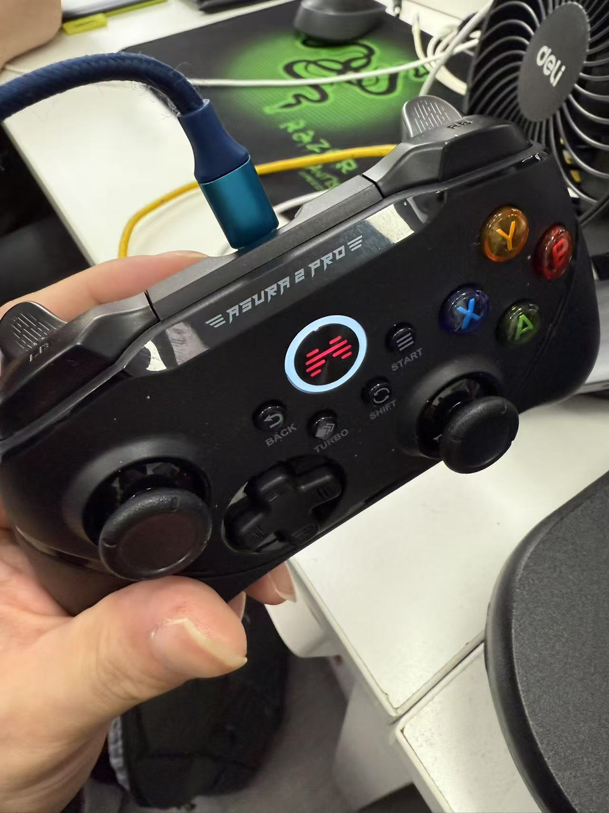
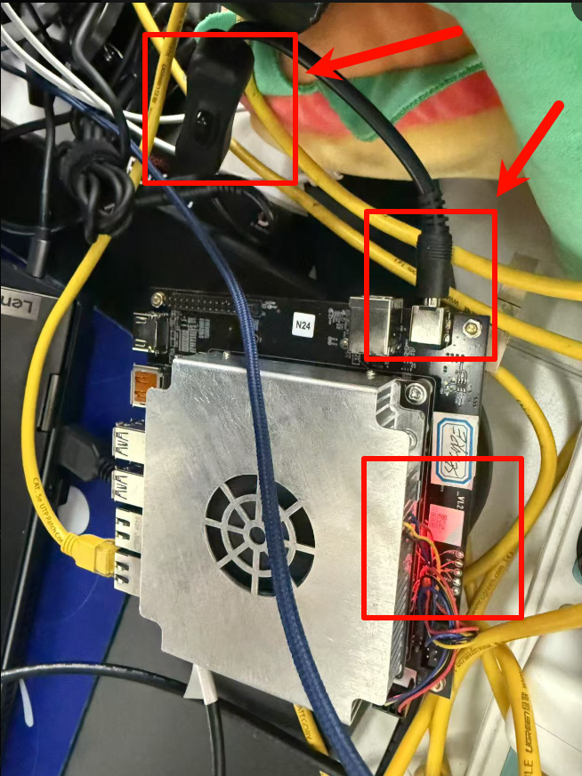

[toc]

# RDK S100部署高擎机电小Pi机器人

## 简介

### 1. 项目背景

自盘古开天辟地以来，人类便不断探索天地万物的奥秘。古人以神话解释自然，用想象勾画理想中的智慧生命。从女娲造人到鲁班造木人，中华文明自古便蕴藏着对“拟人之器”的构想与追求。进入工业文明后，随着机械制造、电子技术的飞速发展，赋予机器“人形”的愿望不再只是神话传说中的梦境。

20世纪初，西方文学作品中的机器人概念逐渐成形，而日本、美国等国率先将机器人原型带入现实。尤其是21世纪以来，人工智能、感知技术、伺服控制等关键领域取得突破，为双足机器人和人形机器人注入灵魂。它们不再只是笨重的机械臂，而逐步具备了感知环境、自主行走、语音交互等“类人”能力。

近十年，双足与人形机器人迎来技术与应用的爆发式增长。从波士顿动力的Atlas到特斯拉的Optimus，再到国内一系列创业团队的奋起追赶，人形机器人正从实验室走向产业化前夜。它们不仅是AI与机器人技术融合的象征，也被视为未来服务、制造、医疗等领域的“新物种”，承载着人类对智能机械伙伴的千年梦想。

高擎机电是一家专注于智能机器人核心技术研发的高科技企业，致力于打造具备自主核心部件和高集成度解决方案的机器人产品。公司团队具备深厚的机电一体化和嵌入式系统开发能力，产品广泛应用于教育科研、工业自动化和服务机器人等领域。高擎机电秉持“技术为本，创新驱动”的理念，推动国产机器人产业链的高质量发展。

“小Pi”是高擎机电推出的一款轻量化双足机器人平台，集运动控制、传感感知与智能交互于一体。该机器人具备仿人步态行走能力，采用模块化设计，方便高校与科研单位进行二次开发和算法验证。通过开放式的软件接口与强大的硬件平台支持，“小Pi”成为人工智能、控制理论与机器人学交叉研究的理想载体。

RDK S100 是由地瓜机器人推出的一款高性能嵌入式算力平台，具备高达 80 TOPS（每秒万亿次运算）的 AI 推理能力，适用于边缘计算、机器人视觉、SLAM导航等高负载场景。该平台体积紧凑、功耗优化，配备多路高速接口，兼容多种主流传感器和控制器，是构建智能机器人系统不可或缺的核心模块。

### 2. 项目介绍

本项目旨在实现RDK S100 高算力平台与高擎机电双足机器人“小Pi的深度融合，打造面向未来的高性能双足机器人智能控制系统。通过将RDK S100作为“小Pi”的核心算力支撑平台，不仅为其提供强大的 AI 推理能力和实时计算能力，更使其具备自主环境感知、行为规划与动态控制等“类脑”智能。

RDK S100 是一款基于**地瓜机器人**自研 Nash 架构 BPU（Brain Processing Unit） 的高算力平台，具备高达 80 TOPS 的 AI 推理能力，专为机器人感知计算与边缘智能而生。该平台不仅集成多种高速接口，能够与多类传感器和执行单元高效对接，还支持低时延、多任务并发处理，非常适合部署于复杂动态环境下的移动机器人系统。

“小Pi”作为高擎机电推出的轻量级双足机器人，采用模块化设计，具备良好的稳定性与拓展性，是教育科研及智能控制算法测试的理想载体。此前，由于受限于传统嵌入式控制器的算力瓶颈，其在多模态感知、复杂环境中的动态运动控制等任务中存在一定局限。

借助 RDK S100 的集成，项目将构建“小Pi”的智能运动控制大脑：在底层完成高频率的实时动作控制与稳定保持，在高层实现基于视觉与传感数据的路径规划、行为决策与交互反馈。平台将支持包括 SLAM、姿态估计、强化学习控制策略等在内的先进算法运行，使“小Pi”具备更流畅的人形步态、更复杂的任务执行能力，以及更自然的人机交互表现。

本项目不仅是一次工程技术集成的尝试，更是对“算力赋能人形机器人”理念的深度实践。它将推动高性能 AI 平台在机器人领域的实用化落地，拓展“小Pi”在科研、教学、展示乃至服务场景中的应用边界，为国产双足机器人迈向更高智能水平打下坚实基础。


## 工程准备流程

### 1. 物料准备

对于此项目，我们需要准备如下物料：

- 笔记本一台
- USB拓展坞（可选）
- 网线
- RDK S100一台
- RDK S100电源线一根
- SD卡一张
- 高擎小pi一台
- 高擎小pi已充好的电池

### 2. 本地模型转换

#### 2.1 模型量化

我们首先在本机准备S100工具链环境。

我们在本机拉取github仓：

```
git clone https://gitee.com/chenguanzhong/rdk_s100_hightorque_pi.git
```

需要进行工具链转换的模型在如下目录下：

```
cd rdk_s100_hightorque_pi/resource/model
```

模型文件为`policy.onnx`，我们需要将该文件单独复制出来到一个文件夹中

先拉取S100工具链docker镜像（docker镜像与OE包请联系工程师获取），拉取用于模型量化的文件夹进行解压（模型量化的文件夹请联系工程师获取，该文件夹中包含量化需使用的配置文件以及校准数据）

将onnx模型放到量化用的文件夹下（确保模型名称与配置文件中一致），并将该文件夹挂在至docker环境中，创建容器（这一步需要自行修改**主机文件夹路径**和**镜像ID**，这个路径将包含上述的`policy.onnx`模型文件）：

```
sudo docker run -it --entrypoint="/bin/bash" -v 主机文件夹路径:/ht_model_convert_s100 镜像ID
```

#### 2.2 模型转换

```
# 进入文件夹
cd /ht_model_convert_s100 

# 量化body，生成model_output_body文件夹，存放.bin模型
hb_compile -c policy_ocnfig.yaml --march nash-e
```

执行完模型转换后，我们会看到一系列回显，该回显会被保存在hb_compile.log中。该log的样例如下：



我们可以在该日志中看到每一个layer的余弦相似度，以及整体的余弦相似度。

最终结果的余弦相似度分为Calibrated Cosine和Quantized Cosine，我们可以从表格中看到，分别为0.999962和0.999962，均大于0.9999（四个9）。

伴随着hb_compile.log文件，我们可以看到，编译的产物还包含了一个`model_output_body`文件夹。我们进入该文件夹，可以看到里面包含一系列onnx和其他的模型文件。

**对于我们有用的文件为`policy.hbm`，这个文件为可以部署在RDK S100 BPU上的地瓜异构模型文件，我们后续需要用到该文件用于部署。**

### 3. 高擎小Pi环境准备

在我们拿到高擎机电的双足机器人小Pi后，请确保小Pi的电量是足够的，具体充电的方法，请参考`工程部署流程`的第二部分。

在完成小pi的充电后，我们使用网线登录小Pi自带的鲁班猫，**我们这里假设小pi自带的鲁班猫存在静态IP，且静态IP为`192.168.129.10`**。

小pi自带的用户名为`hightorque`，登录密码为`ht`。我们可以使用MobaXterm进行登录。

完成登录后，我们拉取github仓：

```
git clone https://gitee.com/chenguanzhong/rdk_s100_hightorque_pi.git
```

完成拉取后，我们将里面的`sim2real_master_dg`文件夹复制出来，复制到根目录下：

```
cd rdk_s100_hightorque_pi
cp -r sim2real_master_dg ~
cd ~
```

在我们完成对应文件夹的复制，且切换回根目录后，我们对项目进行构建：

```
source /opt/ros/noetic/setup.bash
catkin build -j1
```

整个构建花费~30分钟，请耐心等待。

### 4. RDK S100环境准备

我们拿到RDK S100后，为了让RDK S100存在操作系统，我们需要为一张SD卡进行烧录准备。

具体的烧卡的细节可以参考地瓜机器人社区官网，资料，系统烧录：https://developer.d-robotics.cc/rdk_doc/install_os

在完成SD卡的系统烧录后，我们将烧录好的SD卡插入到RDK S100中。我们为RDK S100进行上电，将RDK S100的电源线插入圆孔，确保RDK S100的红灯亮起。

我们通过网线将RDK S100与本机笔记本进行连接，该篇教程**假设RDK S100的静态IP为192.168.1.100，且用户名为root，且登录密码为root**，使用MobaXTerm进行登录。

我们将github仓库拉取到根目录，并创建一个gaoqin目录：

```
cd ~
mkdir gaoqin
git clone https://gitee.com/chenguanzhong/rdk_s100_hightorque_pi.git
```

我们将文件复制出来到gaoqin目录下，

```
cd rdk_s100_hightorque_pi
cp model_task-s100.zip ~/gaoqin
cp main.py ~/gaoqin
```

且在gaoqin目录下，我们存放上文提到的`policy.hbm`文件。


## 工程部署流程

### 1. 电量确认

观察电池如下：



电池打开和关闭的操作：**快速的短按 + 长按（长按至蓝灯闪烁）**
将电池打开，观察电量，一个灯代表25%，电池充满时，四个灯全亮：



### 2. 充电

#### 2.1 电池充电

将电池插入充电槽，**电池凸起的部分朝上，两根手指捏住，插入充电槽**



插入充电槽后，**一定要打开电池才能充上电（即短按再长按）**，看到蓝灯闪烁时，使用小米原装120W的充电器（如公司电脑T14P的充电器），将充电头插上，听到风扇响声，则表示充电成功。使用100W的充电器从0充至100%大约需要~1小时。



#### 2.2 手柄充电

手柄上方有一个typeC充电口，将TypeC充电线插入，看到灯光闪烁，则表示充电成功



### 3. 启动工作

确保电池和电量充满电后，我们进行小pi机器人和S100的启动和连网工作。

#### 3.1 S100远程接入

首先对S100进行上电，将充电线插入充电口后，打开开关（如果没有打开），看到红灯亮起，则表示S100上电成功。



接下来使用网线登录S100，将网线两段分别插入S100的网口和笔记本，首先在电脑端配置静态IP，打开电脑设置，选择“网络和Internet”:


在左侧点击WLAN或以太网，再点击右侧的“更改适配器选项”：


弹出新的窗口，确认连接到的是哪一个以太网，我这边为“以太网2”：


右键“以太网2”，点击“属性“，双击“Internet协议版本4”


进行如下的修改：


修改完成后点击“确认”，退出，打开MobaXTerm，点击Session，弹出新的窗口后，再点击SSH


在Remote Host中输入192.168.1.100，Specify username输入root，输入完成点击OK，进入后密码为root，输入即可


#### 3.2 S100联网

打开手机热点，使用如下命令连网，先扫描wifi：

```
nmcli device wifi rescan
```

随后显示wifi列表：

```
nmcli device wifi list
```

确保要连入的wifi名称存在于列表中。
查看完成列表后，按Ctrl+C，然后按回车即可继续操作。
输入账号密码进行连接：

```
wifi_connect "Jackey124" "12345678"
```

稍作片刻等待，看到如下回显则表示wifi连接成功


将本地计算机连入相同的wifi:


回到mobaXTerm，查看现有网络:

```
ifconfig
```


看到wlan0的ip为172.20.10.2，此时本机与S100处于一个网络中，则可以拔掉网线进行连接。
我们再次打开MobaXTerm进行连接：


方法与之前一样，只是IP需修改为172.20.10.2即可

#### 3.3 小pi启动与联网

按住电池两边的卡扣，**将电池插入小pi，并打开电池（短按再长按）**：


随后看到背面，**先短按关节模组开关（大的），再短按+长按主控系统开关**（小的）


两个灯均显示红灯，且显示屏显示Loading..，则表示可以登录小pi了


将鼠标、键盘、HDMI显示屏线分别插入：


确保屏幕上电，则可以看到高擎机电的画面显示，通过图形化界面连接wifi，点击`Connect`，输入密码即可


新开一个窗口（ctrl + alt +T），输入

```
ifconfig
```


查看wlan0的ip，可以看到为172.20.10.13，此时三个设备都在同一网段，表示我们可以使用mobaXTerm无线接入，使用老方法，不同的是，此时IP为172.20.10.13，而**用户名则为hightorque，点击确认后会让你输入密码，密码为ht**，完成密码输入后，则可以远程登录：


远程登录后，会看到鲁班猫的界面：


此时我们可以在172.20.10.13中ping通172.20.10.2。同理，我们也可以在172.20.10.2中ping通172.20.10.13
举例：
在鲁班猫的172.20.10.13中，输入

```
ping 172.20.10.2
```

### 4. 程序启动

#### 4.1 鲁班猫程序启动

在鲁班猫（172.20.10.13）中，切换目录：

```
cd ~/sim2real_master_dg
```

激活工作空间：

```
source devel/setup.bash
```

启动小Pi

```
roslaunch sim2real sim2real.launch
```

看到回显没有红色报错，且一直打印error_run_state=0，则表示启动成功


#### 4.2 小Pi站立

此时，我们启动手柄，长按中间这个按钮，直到感受到震动即可：


**我们用一只手抬起机器人（这一步很重要！！！），不抬起来容易打坏脚部电机**


另一只手往下按左按钮长按~3s：


此时机器人会自己控制站立：


此时看到回显如下，则表示站立成功：


#### 4.3 桥接话题

我们新开一个172.20.10.13的MobaXTerm窗口，用户名为hightorque，密码为ht


输入如下指令，激活ROS1：

```
source /opt/ros/noetic/setup.bash
```

切换目录：

```
cd ~/sim2real_master_dg/src
```

加载桥接文件

```
rosparam load bridge.yaml
```

再次激活ROS2和ROS1

```
source /opt/ros/foxy/setup.bash
source /opt/ros/noetic/setup.bash
```

启动参数桥接：

```
ros2 run ros1_bridge parameter_bridge
```

看到回显如下，则表示/input_data_topic和/inf_res已成功被桥接：


#### 4.4 S100推理启动

切回至MobaXTerm的172.20.10.2的S100窗口，并切换到如下目录

```
cd gaoqin
```

激活ROS2：

```
source /opt/ros/humble/setup.bash
```

启动程序：

```
python main.py
```

看到推理回显，则表示程序启动成功：


#### 4.5 小pi行走

此时，我们按下手柄上方的LB键（**注意不要误触背后的按钮**），小pi则会开始原地踏步：


启动踏步后，根据左右摇杆进行不同动作：


**前后踏步滑动左摇杆，顺时针逆时针转圈滑动右摇杆**


#### 4.6 小pi停止

同时按下LB + RB，此时需要快速扶住小pi，避免摔倒


小pi休息时，建议蹲下：


关闭：
**先短按长按下方的小按钮，在短按上方的大按钮即可**


再短按长按电池，直到灯熄灭
